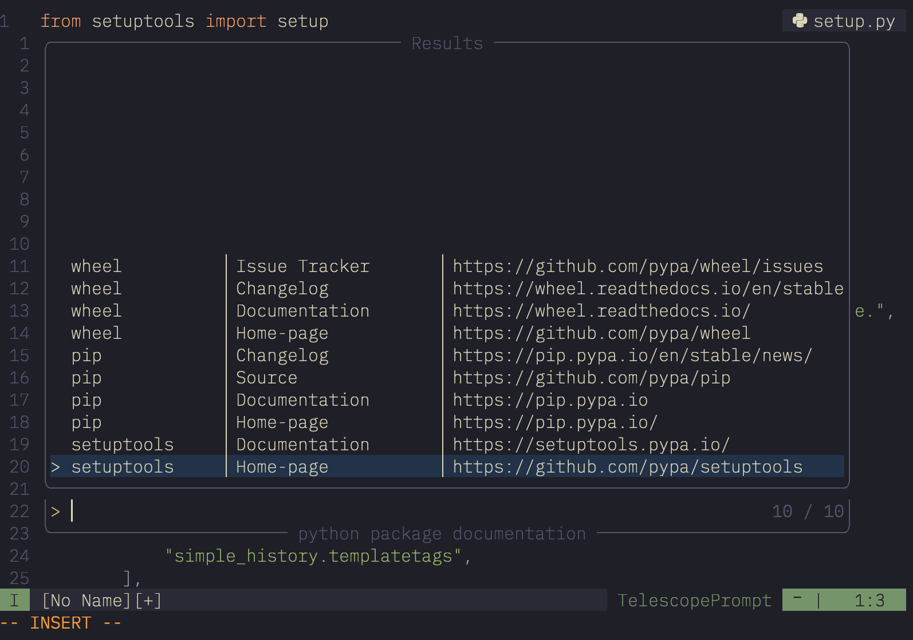

# python-docs.nvim



This is a small plugin to search and open URLs of packages installed in your
virtualenv.

It searches the [python package metadata](https://peps.python.org/pep-0345/) for
`Home-page` or `Project-URL`.

## requirements

* Neovim (0.5+)
* telescope.nvim
* plenary.nvim (which is coming with telescope anyways)
* a `python3` executable

## installation 
### `packer.nvim`

```lua
use({
    "syphar/python-docs.nvim",
    requires = { "nvim-lua/plenary.nvim", "nvim-telescope/telescope.nvim" },
    config = function()
        -- this can also be somewhere else in your config, as long as it's after
        -- telescope was loaded.
        require("telescope").load_extension("python_docs")
    end,
})
```

### `lazy.nvim`

```lua
{
  "syphar/python-docs.nvim",
  dependencies = { "nvim-lua/plenary.nvim", "nvim-telescope/telescope.nvim" },
  event = "VeryLazy",
  config = function()
    require("telescope").load_extension("python_docs")
  end,
}
```

## usage

### commands

```vim
" open the list of URLs, open browser on selection
:Telescope python_docs

" shows the same list of package URLs, but will use a duckduckgo "I'm feeling
" ducky" search for the given selected text on the selected documentation page.
:Telescope python_docs search=some_function_name
```

### example mappings

```vim
" just open finder in normal mode
nnoremap <silent> gh <cmd>Telescope python_docs<CR>

" search for selected text, only works when there are no spaces
vnoremap <silent> gh "zy:Telescope python_docs search=<C-r>z<CR>
```

You can put these into your `after/ftplugin/python.vim` or an `FileType python` autocmd.
